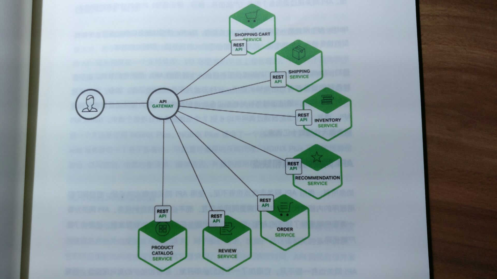
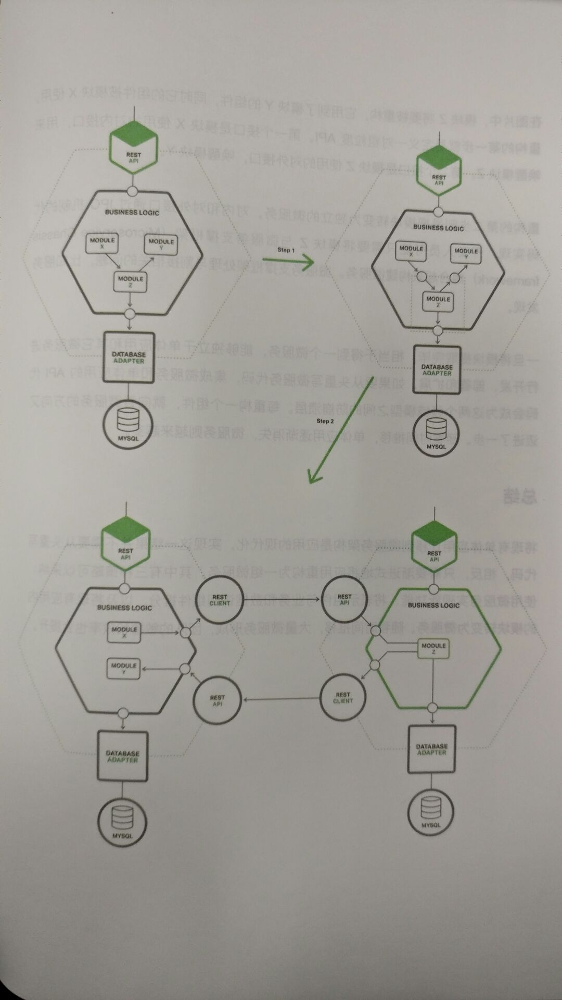

读完《Chris Richardson 谈微服务软件架构设计》后在此对一些重要观点进行记录。

<!-- more -->

## 微服务架构的优势与不足

**优势：**

1. 通过分解巨大单体应用为多个服务方法解决了复杂性问题。
   在功能不变的情况下，应用被分解为多个可管理的分支或服务。
   由此，单个服务很容易开发，理解和维护。
2. 这种架构使得每个服务都可以由专门开发团队来开发。
   开发者可以自由选择开发技术，提供 API 服务。
3. 微服务架构模式使得每个微服务独立部署，开发者不再需要协调其他服务部署对本服务的影响。
4. 微服务架构模式使得每个服务独立扩展。

**不足：**

1. 微服务强调了服务大小。
   尽管小服务更乐于被采用，但是不要忘了微服务只是结果，而不是最终目的。
   微服务的目的是有效的拆分应用，实现敏捷开发和部署。
2. 微服务应用是分布式系统，由此会带来固有的复杂性。
   开发者需要在 RPC 或者消息传递之间选择并完成进程间通讯机制。
3. 分区的数据库架构。
4. 测试基于微服务架构的应用是复杂的任务。
5. 微服务架构模式应用的改变将会波及多个服务，需要考虑相关改变对不同服务的影响。
6. 部署微服务很复杂。
   还需要完成一个服务发现机制，以用来发现与它通讯服务的地址。

## 使用 API 网关构建微服务

### API 网关的优缺点

最大的优点是封装了应用程序的内部结构。
简化了客户端代码。

缺点是增加了一个必须开发、部署和维护的高可用组件。
另外，API 网关成为了开发瓶颈。
更新网关的过程要尽可能简单，否则不得不排队等待。

### 实现 API 网关

- 性能和可扩展性
- 使用响应式编程模型
- 服务调用
- 服务发现
- 处理局部失败

## 微服务架构中的进程间通信

### 交互模式

| Type         | One-to-Many            | One-to-One             |
| ------------ | ---------------------- | ---------------------- |
| Synchronous  | -                      | Request/response       |
| Asynchronous | Publish/subscribe      | Notification           |
|              | Request/async response | Publish/async response |

### 处理局部失败

- 网络超时
- 限制请求次数
- 断路器模式（Circuit Breaker Pattern）：记录成功和失败的请求数量。
  如果失败率超过阀值则触发一个失效期。
- 提供回滚

### 基于消息的异步通信

**优点：**

- 解耦客户端和服务端
- 消息缓冲：使用消息队列。
- 客户端-服务端的灵活交互：消息机制支持所有交互模式。
- 清晰的进程间通信

**缺点：**

- 额外的操作复杂性：消息系统需要单独安装、配置和部署。
  消息代理必须高可用。
- 实现基于请求／响应交互模式的复杂性。

## 服务发现的可行方案以及实践案例

### 客户端发现模式

客户端从服务注册服务中查询，其中是所有可用服务实例的库。
客户端使用负载均衡算法从多个服务实例中选择出一个，然后发出请求。

这一模式相对直接，除了服务注册外其他部分无需变动。
由于客户端知晓可用的服务实例，能针对特定应用实现智能负载均衡，比如哈希一致性。

一大缺点是客户端与服务注册绑定，要针对服务端用到的每个编程语言和框架实现客户端的服务发现逻辑。

### 服务端发现模式

客户端通过负载均衡器向某个服务提出请求，负载均衡器查询服务注册表，并将请求转发到可用的服务实例。
如同客户端发现，服务实例在服务注册表中注册或注销。

最大优点是客户端无需关注发现的细节，只需要简单的向负载均衡器发送请求，减少了编程语言框架需要完成的发现逻辑。
缺点是除非负载均衡器由部署环境提供，否则会成为一个需要配置和管理的高可用系统组件。

### 服务注册的方式

1. 自注册方式

   服务实例负责在服务注册表中注册和注销。
   另外，服务实例也要发送心跳来保证注册信息不会过时。

   优点是简单，无需其他系统组件。
   缺点是把服务实例和服务注册耦合，必须在每个编程语言和框架内实现注册代码。

2. 第三方注册模式

   由服务注册器处理会通过查询部署环境或订阅事件的方式来跟踪运行实例的更改。

   优点是服务与服务注册解耦。
   缺点是要配置和管理一个高可用的系统组件。

## 事件驱动的数据管理

### 事件驱动的架构

当有显著事件发生时某个微服务会发布事件，其他微服务订阅这些事件。
当某一微服务接收到事件就可以更新自己的业务实体，实现更多事件被发布。

优点是使得事务跨多个服务并提供最终一致性，也可以让应用维护物化视图。
缺点是编程模型比 ACID 事务复杂。
为了从应用级别的失效中恢复，还需要完成补偿性事务。
要处理临时事务造成的数据不一致。

### 实现原子化

例如插入一行数据然后发布事件。
确保原子化的标准做法是使用包含数据库和消息代理的分布式事务。

#### 使用本地事务发布事件

实现原子化的方法是使用多步骤进程来发布事件，该进程只包含本地事务。

用一个事件表来充当消息队列。
应用启动一个本地数据库事务，更新业务实体的状态，在事件表中插入一个事件，并提交该事务。
独立的应用线程或进程查询事件表，将事件发到消息代理，然后用本地事务标注事件并发布。

优点是保证每个更新都有对应的事件发布，并且无需依赖 2PC（两步提交）。
发布业务级别的事件，消除来推断事件的需要。
缺点是开发者必须牢记发布事件。
对 NoSQL 数据库应用是个挑战，NoSQL 本身交易和查询能力有限。

#### 挖掘数据库事务日志

应用更新数据库，数据库的事务日志记录变更。
事务日志挖掘线程或进程读取这些日志，并发布到消息代理。

优点是无需 2PC，日志发布与应用业务分离，简化应用。
缺点是事务日志的格式与每个数据库对应。
很难逆向工程业务事件。

#### 使用事件源

分别存储业务实体和业务状态。

优点是解决了事件驱动的微服务架构的一个关键问题，能够只要状态改变就可靠的发布事件。
解决了数据一致性问题。
业务逻辑由松耦合的、事件交换的业务实体构成。

## 选择微服务部署策略

### 单主机多服务实例模式

在一台物理或虚拟主机上运行多个服务实例。

**优点：**

- 资源利用率相对高效，多服务实例共享服务器及操作系统。
- 部署服务实例更快，只需将服务复制到主机并启动。
- 开销不多，启动服务通常很快。

**缺点：**

- 除非每个服务实例是一个单独的进程，否则会甚少或者没有隔离。不能限制每个实例使用的资源，很可能一个异常的服务实例会消耗主机所有的内存和 CPU。
- 所有实例可能共享同一个 JVM 堆，出现异常的服务实例能够轻易中断运行在同一进程的其他服务。
- 部署服务的运维团队需要了解部署的具体细节，增加率出错的风险。

### 单主机单服务实例模式

#### 单虚拟机单服务实例模式

**优点：**

- 每个服务实例完全隔离运行，每个实例都有固定的 CPU 和内存。
- 能充分利用成熟的云基础设施。
- 封装了服务的实施技术。一旦服务打包成虚拟机就变成了黑盒，虚拟机的管理 API 成为部署该服务的 API。

**缺点：**

- 资源利用率低。有操作系统的开销。公有 IaaS 部署成本会因利用率低而增高。
- 部署服务的新版本通常很缓慢。
- 用户或组织中的其他人要负责大量无差别的沉重工作。

#### 单容器单服务实例模式

容器技术更为轻量，容器镜像构建速度更快。

缺点是管理容器镜像是一项无差别的繁重工作。
除非使用 Google Container Engine 或 Amazon EC2 容器服务。

#### 无服务部署

AWS Lambda 不适合用来部署长期运行的服务。
服务必须保持无状态。
必须用某一种支持的语言完成。

## 使用微服务重构单体应用

Martin Fowler 所言，“大规模重写唯一能够保证的只有大规模！”

应当采取逐步重构单体应用的策略。
逐步构建一个由微服务构成的应用，与单体应用并行运行；
随着时间推移，原先由单体应用实现的功能不断收缩，最后或者完全消失，或者转变成微服务。

**策略：**

1. 停止挖坑：停止单体应用继续变大，应该把部分新代码开发成独立的微服务。
   新服务和旧服务直接有一层胶水代码，也被称作防崩溃层（anti-corruption layer）。
2. 拆分前端和后端：一个应用包含表示层，另一个包含业务和数据访问逻辑。
   通过远程调用。
3. 提取微服务：提取后单体应用不断收缩。
   - 为需要转化为微服务的模块设置优先级：可以根据获益程度、资源需求等。
   - 如何提取模块
     1. 定义模块和单体应用间的粒度接口
     2. 单体应用和微服务通过 API 通信

